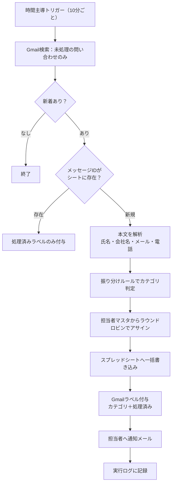

# Gmail問い合わせ自動振り分け → スプレッドシート転記（担当者自動アサイン）

Gmailに届く問い合わせメールを自動で読み取り、**カテゴリ分け・項目抽出・台帳への記録・担当者の割り当て・通知**までを一気通貫で自動化する Google Apps Script です。

## 解決する課題

| Before | After |
|---|---|
| 受信箱を人が見て、問い合わせかどうか判断 | 10分ごとに自動で検出 |
| 本文から氏名・会社名・連絡先を手でコピペ | 本文を解析して自動で転記 |
| 「これ誰が対応する？」とSlackで相談 | ルールに従って担当者を自動アサイン |
| 対応漏れ・二重対応が発生 | 受付ID＋ステータスで台帳管理、重複取り込みなし |

振り分けルールと担当者は**スプレッドシート上で編集できる**ため、コードを触らずに運用を変更できます。

## 処理フロー



## 機能

- **自動取り込み**：検索条件に一致し、まだ処理していないメールだけを取得
- **カテゴリ振り分け**：キーワードルール（優先度・判定対象を指定可能）でカテゴリを判定し、Gmailに `問い合わせ/見積` などのラベルを付与
- **項目抽出**：`お名前：xxx` / `【会社名】xxx` / 値が次の行にある形式など、一般的なフォーム送信メールに対応。全角数字の電話番号も半角に正規化
- **担当者の自動アサイン**：カテゴリごとに対応可能なメンバーへ順番に割り当て（ラウンドロビン）
- **担当者通知**：割り当てられた担当者に、要点とGmail・シートへのリンクを添えたメールを送信
- **台帳管理**：受付ID（`INQ-00001` 形式）、ステータスのプルダウン、Gmailへの直リンク付き

## シート構成（`setup()` で自動作成）

| シート | 役割 | 主な列 |
|---|---|---|
| 問い合わせ一覧 | 台帳 | 受付ID / 受信日時 / カテゴリ / ステータス / 担当者 / 件名 / 差出人 / 会社名 / 電話番号 / 本文抜粋 / Gmailリンク |
| 振り分けルール | カテゴリ判定ルール | 優先度 / カテゴリ / キーワード / 判定対象（件名・本文・両方） / 有効 |
| 担当者マスタ | アサイン対象 | 担当者名 / メールアドレス / 担当カテゴリ（`*` で全カテゴリ） / 有効 |
| 実行ログ | 運用監視 | 日時 / レベル / 内容 |

## セットアップ手順

1. 新しいGoogleスプレッドシートを作成
2. メニュー「拡張機能」→「Apps Script」を開き、`Code.gs` の内容を貼り付けて保存
3. 関数 `setup` を選んで実行（初回は権限の承認が必要）
4. 「担当者マスタ」「振り分けルール」を実際の運用に合わせて編集
5. `CONFIG.BASE_QUERY` を自社の問い合わせメールに合わせて調整（**先にGmailの検索窓で同じ条件を試し、想定どおりのメールだけがヒットすることを確認**）
6. 関数 `setupTrigger` を実行して定期実行を開始

## テスト手順

| 順番 | 関数 | 内容 | 変更されるもの |
|---|---|---|---|
| 1 | `testParse` | サンプル本文の項目抽出とカテゴリ判定をログ表示 | なし |
| 2 | `sendTestInquiry` | 自分宛てにサンプル問い合わせを送信 | 受信箱にテストメール |
| 3 | `testDryRun` | 取り込み予定の内容をログ表示 | なし |
| 4 | `processInquiries` | 本番処理を1回実行 | シート・ラベル・通知 |

## 設定項目（`CONFIG`）

| 項目 | 既定値 | 説明 |
|---|---|---|
| `BASE_QUERY` | `subject:(お問い合わせ OR 問い合わせ OR 見積) newer_than:7d` | 取り込み対象の検索条件 |
| `MAX_THREADS_PER_RUN` | `20` | 1回の実行で処理する件数の上限 |
| `NOTIFY_ASSIGNEE` | `true` | 担当者通知の有無 |
| `DRY_RUN` | `false` | `true` で一切の変更をせずログのみ |
| `TRIGGER_MINUTES` | `10` | 定期実行の間隔（1/5/10/15/30） |

## 設計上の工夫

- **二重取り込み防止（二段構え）**：Gmailの「処理済み」ラベルで検索対象から除外し、さらにシート上のメッセージIDとも照合。ラベルが手動で外されても重複登録されません
- **「書き込み → ラベル付与」の順序**：シートへの書き込みが成功してからラベルを付けるため、途中でエラーが起きても次回の実行で自動的に再取り込みされ、取りこぼしが発生しません
- **通知メールの再取り込みループ防止**：通知メールの件名に元の件名を含めず、検索条件でも通知メールを除外。「通知メールが問い合わせとして取り込まれ、また通知が飛ぶ」という事故を防いでいます
- **同時実行の防止**：`LockService` で、処理が長引いた際にトリガーが重なっても二重実行しません
- **数式インジェクション対策**：`=` や `+` で始まる外部入力は文字列として保存し、シート上で数式として実行されないようにしています
- **Fromが代表アドレスになるケースへの対応**：フォームサービス経由のメールに備え、連絡先は「本文の記載 → Reply-To → From」の優先順位で取得
- **非エンジニアが運用できる設計**：ルールと担当者はシートで管理し、コード変更なしで運用を変更可能

## 制限事項・注意点

- Gmailの送信数には1日あたりの上限があります（無料のGoogleアカウントは特に少なめ）。問い合わせが非常に多い場合は `NOTIFY_ASSIGNEE` を `false` にするか、Slack通知への切り替えを推奨します
- 対象はスレッドの**最初のメッセージ**です。取り込み後の同じスレッド内の返信は対象外です（台帳の「Gmailリンク」から確認できます）
- 本文の項目抽出は「項目名：値」形式のフォーム送信メールを前提としています。自由文のメールでは差出人情報のみ記録されます
- ラウンドロビンの位置と受付IDの連番は「スクリプトプロパティ」に保存されています。削除すると連番が1からやり直しになります

## 拡張アイデア

- **AIによるカテゴリ判定**：キーワードで判定できなかった「その他」だけを生成AIに分類させ、要約も台帳に追加
- **Slack通知**：ポートフォリオ #1 の Slack Webhook 連携を組み合わせ、チャンネルにも通知
- **負荷分散アサイン**：ラウンドロビンではなく「未対応件数が最も少ない担当者」に割り当て
- **SLA監視**：「未対応」のまま一定時間経過した問い合わせをアラート

## ファイル構成

```
gmail-inquiry-router/
├── Code.gs      # メインスクリプト
└── README.md    # このファイル
```

## 使用技術

Google Apps Script（GmailApp / SpreadsheetApp / LockService / PropertiesService / ScriptApp）
